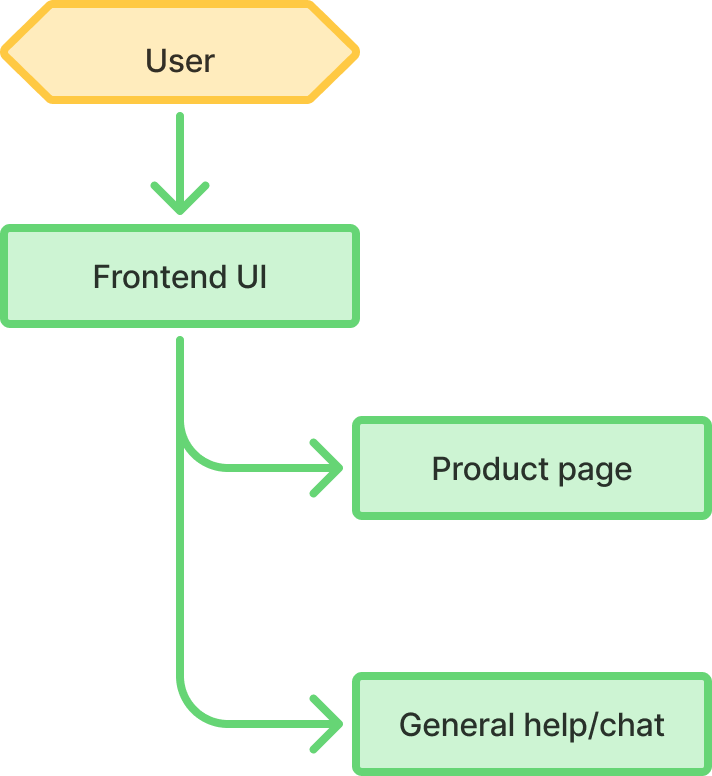
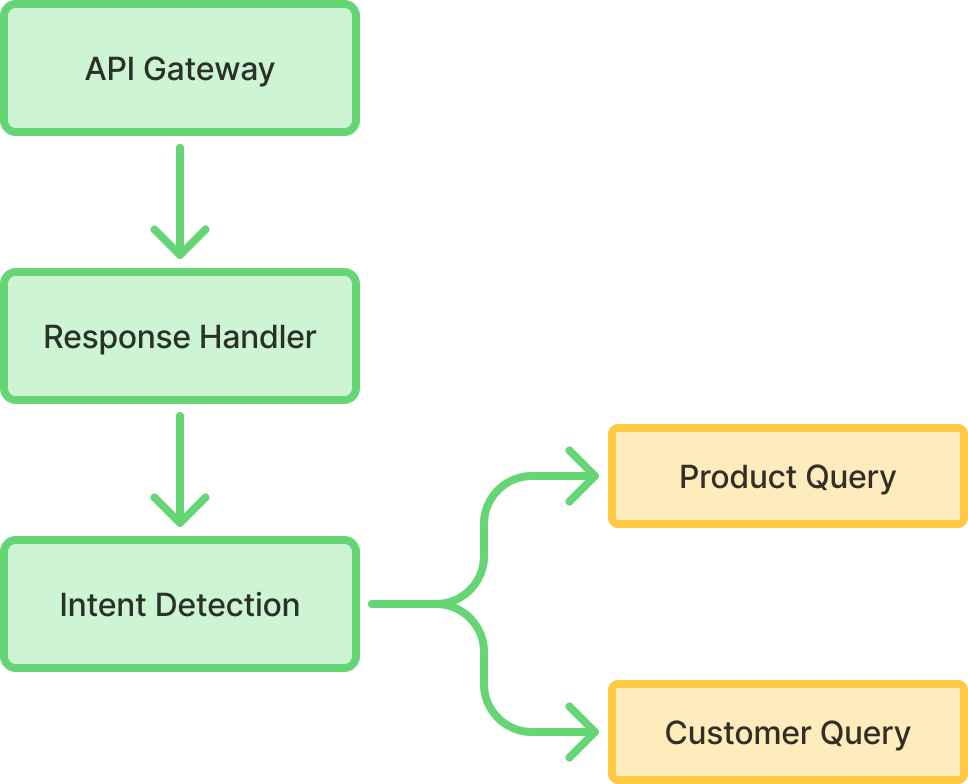
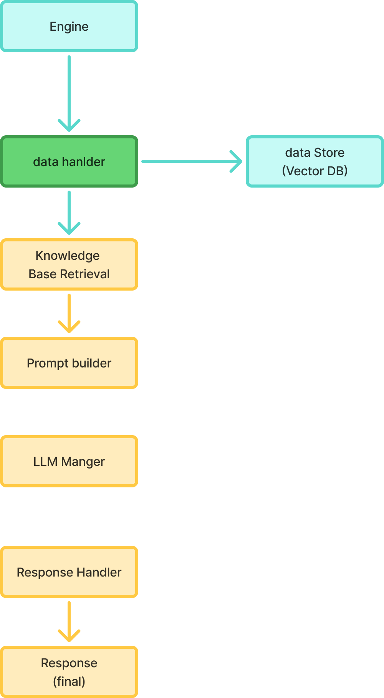
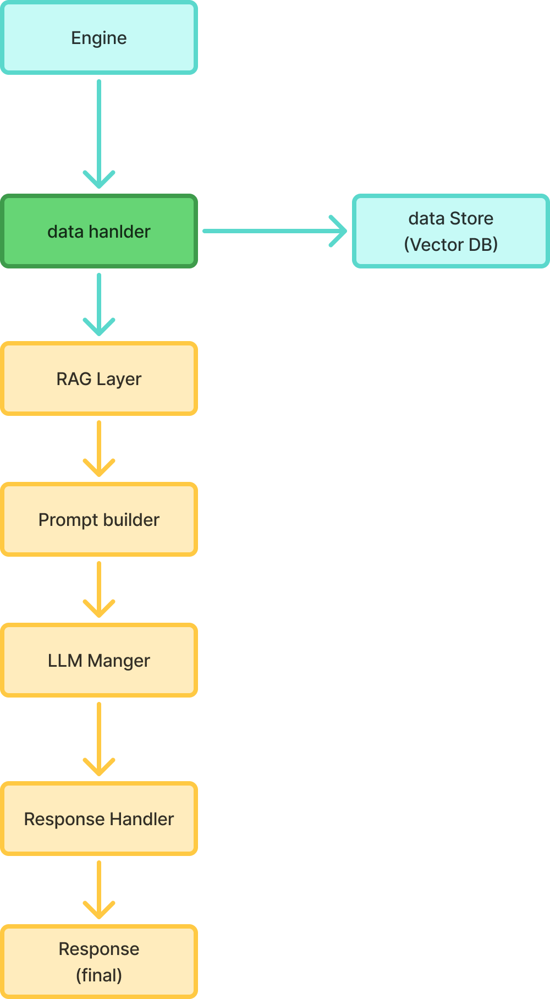

# PROBLEM BASED LEARNING-I

**Domain:** Artificial Intelligence

**Problem Statement:** Design a conversational bot for customer service that handles common queries. Compare solutions like rule-based systems, NLP libraries, or pre-trained models like GPT.

---

## **Project:** SmartCart

AI-assisted E-commerce Embedded System using pre-trained language models with a local-first approach (Ollama), with cloud fallback (Gemini / GPT).
The system embeds AI directly into e-commerce workflows to help users analyse products and get accurate, contextual answers to product-related queries.
Description

SmartCart is an AI-driven conversational assistant seamlessly integrated within e-commerce product pages. Each product is equipped with an “Ask about this product” interface, enabling users to examine product specifications, perform comparative evaluations with similar items, summarize customer reviews, and pose context-sensitive follow-up queries. The system emphasizes grounded responses, ensuring that information is accurate, consistent, and relevant to the displayed product.

The assistant operates using a local-first LLM approach (Ollama) combined with a Retrieval-Augmented Generation (RAG) pipeline over structured product data (synthetic). Cloud-based LLMs (Gemini / GPT) are used only as fallback.
The project focuses on system design, grounding, safety, and realistic AI UX, not real-world payments or live order integration.

---

## Abstract

Customer service chatbots in e-commerce have traditionally relied on rule-based logic or shallow NLP pipelines, resulting in limited contextual understanding, poor scalability, and brittle user interactions. Recent advances in large language models (LLMs) enable more natural and adaptive conversational systems. However, their direct deployment raises concerns around grounding, hallucinations, cost, and data dependency.

This project presents SmartCart, an AI-assisted conversational customer service system embedded directly within e-commerce product pages. The system is designed to handle common customer queries such as product comparison, specification analysis, review summarization, and contextual follow-up questions. Unlike rule-based systems that depend on predefined intents, or standalone NLP libraries that require extensive feature engineering, SmartCart leverages pre-trained language models integrated with a Retrieval-Augmented Generation (RAG) pipeline to ensure responses are grounded in structured product data.
A local-first architecture is adopted using on-device LLM inference via Ollama, prioritizing privacy, latency reduction, and cost efficiency. Cloud-based models (Gemini / GPT) are employed only as fallback mechanisms when local inference is insufficient. Product knowledge is sourced from synthetic, structured JSON datasets, enabling controlled experimentation without reliance on live commercial data. The system incorporates explicit safety and uncertainty handling, ensuring that queries outside the available knowledge base are addressed with transparent and non-speculative responses.

Through scenario-based evaluation including quick product comparison, eco-attribute analysis, and suitability assessment SmartCart demonstrates how pre-trained LLMs, when combined with retrieval grounding and system-level constraints, significantly outperform traditional rule-based and classical NLP approaches in flexibility, accuracy, and user experience. The project emphasizes system design, conversational grounding, and realistic AI interaction patterns rather than transactional functionality, making it suitable for academic evaluation in applied artificial intelligence.

---

## **System Design**

The SmartCart system is designed with a modular architecture that integrates various components to provide a seamless conversational experience for users. The key components of the system include:

1. **User Interface (UI):** The UI is embedded directly within e-commerce product pages, allowing users to interact with the chatbot through an “Ask about this product” interface. The UI is designed to be intuitive and responsive, providing a natural conversational experience.
2. **Local LLM Inference (Ollama):** The system utilizes a local-first approach for language model inference using Ollama. This allows for fast response times and enhanced privacy, as user queries are processed on-device without the need for constant cloud communication.
3. **Retrieval-Augmented Generation (RAG) Pipeline:** The RAG pipeline is responsible for retrieving relevant information from structured product data (synthetic JSON datasets) and generating responses based on that information. This ensures that the chatbot's responses are grounded in accurate and relevant data.
4. **Cloud Fallback (Gemini / GPT):** In cases where the local LLM inference is insufficient to handle a query, the system falls back to cloud-based models like Gemini or GPT. This ensures that users receive accurate responses even when the local model's capabilities are exceeded.
5. **Safety and Uncertainty Handling:** The system incorporates mechanisms to handle queries that fall outside the available knowledge base. In such cases, the chatbot provides transparent and non-speculative responses, ensuring that users are aware of the limitations of the system.
6. **Product Knowledge Base:** The product knowledge is sourced from synthetic, structured JSON datasets. This allows for controlled experimentation and ensures that the chatbot's responses are based on accurate and relevant information.

Customer Engine

Product Engine

  

---

## Technical Stack

- **Programming Language:**
  TypeScript (Node.js for backend services, React.js with Next.js for frontend)

- **LLM Inference:**
  Local inference using Ollama for privacy and low latency, with Gemini / GPT as a controlled cloud fallback when local inference is insufficient.

- **Primary Data Storage:**
  MongoDB for storing structured product data including product metadata, specifications, pricing, and raw customer reviews.

- **Vector Storage (RAG Layer):**
  Chroma Vector Database used to store embeddings generated from selected product text fields (such as descriptions and reviews) to enable semantic retrieval during query processing.

- **Embedding Generation:**
  Sentence-transformer or LLM-based embedding models to convert product text into vector representations before indexing in Chroma.

- **API Communication:**
  RESTful APIs for communication between frontend, backend services, and AI inference components.
- **Frontend:**
  React.js with Next.js for server-side rendering and optimized routing, styled using Tailwind CSS.

Product data is persisted in MongoDB as the system’s source of truth. Vector embeddings are generated on demand for selected product content and indexed in Chroma to support semantic retrieval within the RAG pipeline.

---

## License Closed

This project is licensed under a Closed License. Unauthorized use, distribution, or reproduction of this project is prohibited without explicit permission from the author.
For inquiries regarding licensing, please contact the project maintainer.

---

## Contact

For questions or further information about the SmartCart project, please contact:

- Name: NIKHIL KATKURI
- Email: [nikhilprojects07k@gmail.com](nikhilprojects07k@gmail.com)
- GitHub: [@nikhilKatkuri](https://github.com/nikhilKatkuri)
- LinkedIn: [Nikhil Katkuri](https://www.linkedin.com/in/katkurinikhil)
- Portfolio: [URL](https://portfilo-livid.vercel.app/)
